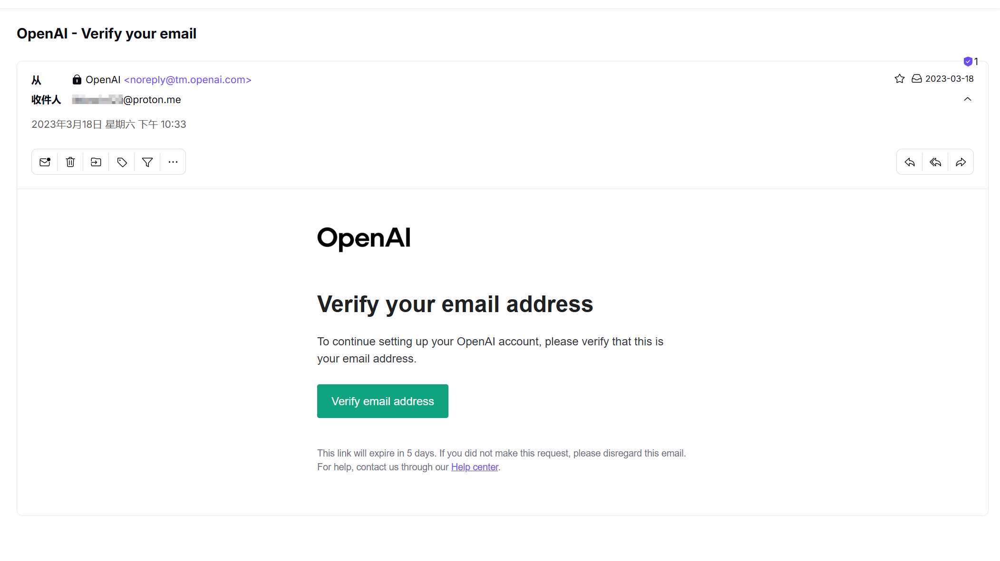
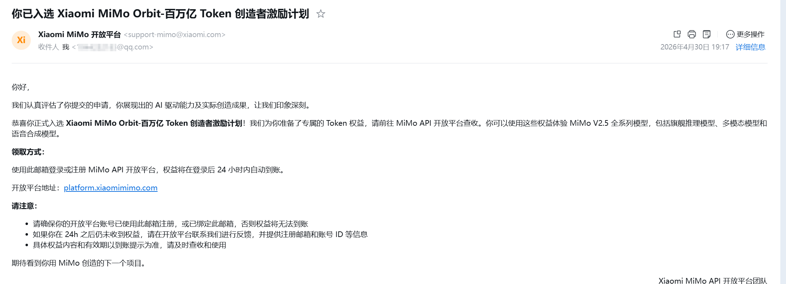

+++
title = "从ChatGPT到Agent：一个CS学生的AI三年体验"
date = 2026-06-17
draft = false
tags = ["生活", "AI"]
+++
> 我是个即将毕业的计算机专业学生，也算是也是亲眼看着 AI 改变整个行业。从 2023 年初第一次用 ChatGPT 到现在，三年时间，AI 从聊天机器人变成写代码离不开的工具，再到现在开始聊 Agent，这一路我都是亲历者。网上关于 AI 的讨论太多，这篇我不对比模型，也不做任何评价，就讲我自己真实的使用经历：从最开始把 AI 当 Siri，到写代码离不开，再到现在用 Agent 的全过程 —— 一个普通 CS 学生，三年和 AI 一起成长的记录。

## **一、入坑：从百度到 ChatGPT**

2023年初，大一，第一次听说ChatGPT。网上说的神乎其神，但我当时心里想的是：这东西和Siri能有多大差别？

直到在朋友圈看到有人用它做拍摄脚本创作，才决定试一试。折腾了一番注册流程，终于收到了确认邮件：

最开始就是让它帮我写材料、写作文，省得去百度翻半天。直到有次写代码卡住了，实在想不出来该怎么写，把问题丢给它试了试——结果它居然写出来了。那一刻我盯着屏幕反应了好几秒。这玩意儿，跟Siri确实不是一回事。

从那以后，我再查技术问题基本不打开百度、B站、CSDN了。不是那些平台没价值，而是ChatGPT给答案的方式太直接了——你问一个问题，它给你一个完整的回答，不懂还可以追问，它换着花样给你讲，讲到懂为止。那段时间的学习效率比以前高了一大截，时间都花在“理解”上，而不是“寻找”上。

## **二、质疑：AI 写的代码其实挺傻的**

用了一年以后，新鲜感开始退潮。我发现ChatGPT写代码并没有想象中那么靠谱。它会生成一些看起来很对、但跑起来全是错的代码；它会在一次对话里反复犯同一个逻辑错误；它会信誓旦旦地告诉你某个函数存在，然后你发现那是它自己编的。上下文一长就开始"失忆"，改完A处的bug，B处又冒出来新问题。

也是在那段时间，一次课设和同学聊起来，他二话不说给我装了Cursor。安装之前我甚至没听说过这个工具。试了一下，确实有一些让人眼前一亮的小功能，可以直接把文件拖到对话框，对比一段段复制效率高多了。但写出的代码质量也就那样，没多久也就束之高阁了。

那一年我对 AI 的看法就是：AI 写代码，可能被吹过头了。

当时对国产模型也完全没兴趣。文心一言、通义千问，天天可以刷到，但我连注册都懒得弄 —— 虽说 ChatGPT 写代码也没那么神，但至少用熟了，犯不着折腾。

## **三、转折：DeepSeek 让我第一次觉得"国产可以"**

2024年底到2025年初，情况开始变化。

先是ChatGPT明显变"笨"了。答非所问、代码质量下滑、逻辑混乱——网上管这个叫"降智"，也不知道是OpenAI故意在砍推理成本还是怎么回事。总之那段时间用得特别不舒服。

然后DeepSeek火了。先是2024年12月V3发布，以极低训练成本实现了接近GPT-4o的性能，引发行业关注；接着2025年1月 R1 发布，彻底破圈；到了春节前后，几乎整个互联网都在讨论它。

我抱着试试看的心态体验了一下。出乎意料——生成内容质量出乎意料的高，那是我第一次觉得"国产好像真的可以了"。但"可以"是一回事，"能用"是另一回事。DeepSeek当时最常见的回答不是答案，而是"服务器繁忙，请稍后再试"。

## **四、实习：被迫换国产，结果意外不错**

真正让我对国产模型彻底改观的，是大四实习。

到工位第一天，由于公司电脑无法访问ChatGPT，看到同事们都在用各种国产模型写代码、查文档，我也跟着用了一段时间。本来以为会很别扭，结果出乎意料——国产模型在中文场景下的理解能力和响应速度，有时候比 ChatGPT 还顺手。代码生成、文档解读、日常问答，体验并不差。它不是"平替"，在某些场景下已经是"优选"了。

那段时间同事也提起过，说 Cursor 现在很强，一定条件下代码可以100%用AI生成。但我脑子里还是2024年那次课设时不太好的使用记忆，就没太上心。现在回头看，是被过去的刻板印象锚定了。

## **五、折腾：毕业设计教会我的事**

真正让我对AI编程工具彻底改观的，是毕业设计。毕业设计做了大概三分之一的时候，“古法编程”的效率实在跟不上进度。试着重新打开了Cursor——毕竟实习时同事说过它现在很强。这次真的不一样了，代码补全的准确率、跨文件的理解能力、上下文感知，都比2024年那会儿上了一个台阶。但刚用顺手，免费额度就没了。

抱着试一试的心态下载了与Cursor定位相似的Trae，搭配着智谱刚发布的旗舰模型 GLM-5.1 一起用。一开始体验确实不错，帮我完成了不少工作。但好景不长。Trae开始频繁排队，动不动就是"请求量过大"，体验急转直下。

没办法，又开始折腾。听说Claude Code很强，但Anthropic官方调用Claude系列模型的费用我用不起。去研究怎么给Claude Code接第三方模型，照着教程用 CC switch 很轻松就实现了。把 DeepSeek-V4 的API接了进去——沉寂了许久的DeepSeek终于发布了新的大模型——1M超长上下文、优秀的编程能力帮助我继续推进毕设项目。虽说DeepSeek的使用成本已经比同类模型低很多了，但高强度用下来，一天也要十多块钱。对于学生党来说还是有些捉襟见肘。

正发愁的时候，刷到了小米的 "MiMo Orbit 百万亿 Token 计划"—— 面向全球 AI 用户免费发放 Token，申请制。抱着试试看的心态提交了申请，项目填的就是还没做完的毕业设计半成品。审核出乎意料地快，不到一天就批下来了：

靠着这波"薅羊毛"，我顺利完成了毕设剩下的所有编码工作。

回头看这段经历，关键词就两个字：**折腾**。从一个工具换到另一个，从免费到付费再到免费，从官方API到折腾第三方接入——但正是这段折腾，让我对AI产生的大大的震撼。

说一个很直观的变化：之前用 ChatBot 这类问答式 AI 工具，全程需要我逐条下达指令，“帮我写个函数”“帮我解释这段代码”，它产出内容，我逐条复核后再合并进项目。本质上它只能承接碎片化单点任务，每一步都要我明确指引、全程盯控。

到了Agent时代——用Claude Code、Codex、Trae的Solo模式、Cursor的Agent模式这些——变成了我给它一个目标，它自己去读代码、建文件、改逻辑、跑测试。第一次用的时候特别不适应，它一口气生成了几百行代码，修改了十几个文件，速度快到我根本review不过来。一开始我还有点慌，必须要看完核心的实现逻辑，确认大方向没问题再合进去。后来，说实话，我开始无脑yes了，闭着眼睛往下走。居然也没出什么大问题。

那一刻我才真正意识到——Agent已经不是一个"聊天机器人"了，它是一个**能自己干活的东西**。

## **六、TRAE Friends：星巴克里的tea talk**

毕业答辩前那段空档，收到一条字节跳动的推广短信，说有个叫“TRAE Friends”的线下活动，在一家星巴克里做tea talk。想着反正也没什么事，就报了名。没过多久收到了审核通过的通知。

分享的是一位 Trae 的研发工程师，主题是《从编码助手到真实工作流》。他讲了“SOLO，本身就是用 SOLO 造出来的”——93%的AI代码贡献率，超过100万行代码，AI是主力，人类做决策和监督。PPT里有一个理念让我印象很深：PPT 中提出的「Spec First, Code Next」方法论完美契合我后期摸索出的开发节奏：先让 AI 输出完整技术方案，确认整体架构无偏差后再拆分编码任务，每一个阶段设置校验节点。我此前只是无意识摸索出这套流程，而研发团队已经将其标准化。

PPT里列的那些痛点，我全经历过。多任务并行互相"串味"、上下文成本高、review负担重——他说这些东西的时候，我坐那儿一直在点头。自由提问环节有人问了一个我特别有共鸣的问题：Agent生成代码太快，review不过来怎么办。嘉宾的回答大概是：核心逻辑看明白，剩下的相信它，测试阶段做自动化验证兜底。和我无脑yes的体验如出一辙。

那一场聊完，没什么惊天动地的收获，做工具的人和用工具的人坐一起聊了聊。走的时候没觉得有什么大道理，就一个念头——哦，原来他们也在想同样的事。

## **结尾**

三年过去，从ChatGPT到DeepSeek再到MiMo，从免费到自己掏钱买API Key，每个都陪我写过代码、改过bug、熬过夜。回头看2023年那个觉得"这不就是个Siri"那天，其实是一扇刚被推开了一条缝的门。

马上要毕业了。我不知道三年后AI会变成什么样，也不知道程序员这个职业会被改写成什么样。但我知道一件事：这三年我学会的不是某个模型怎么用，而是怎么和一个快速变化的世界相处。

下一个三年，继续看，继续学，继续折腾。
