+++
title = "Git 实战指南"
date = 2026-05-27
draft = false
tags = ["Git", "工具"]
+++
> 这篇文章面向 Git 初学者。从"为什么要用版本控制"讲起，覆盖 Git 的核心概念与常用操作，讲解 worktree 多分支并行开发、提交规范，最后介绍 GitHub / GitLab / Gitee 协作流程。

# 一、为什么要用版本控制

在讲 Git 之前，先回答一个更基本的问题：**写代码为什么要用版本控制工具？**

## 没有版本控制时的日常

想象一下你正在写毕业论文或课程作业，你的文件夹里可能是这样的：

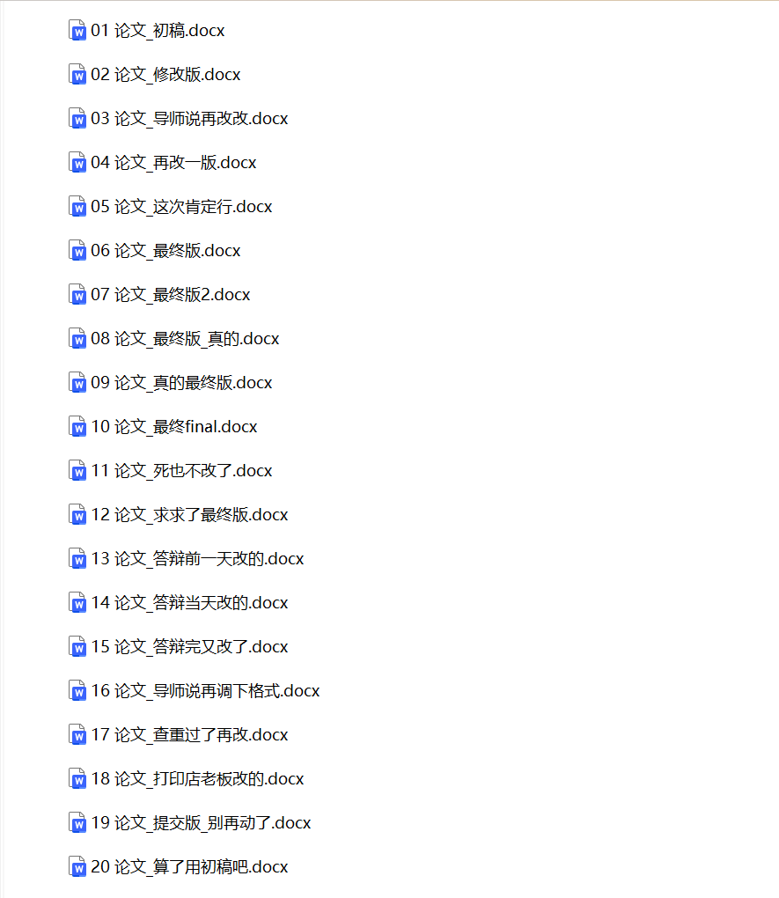

写代码也一样。没有版本控制时，你可能靠**复制文件夹**来"备份"，或者在文件名后面加日期。这种方式有几个根本问题：

1. **不知道改了什么**：两个版本的代码有什么差异？只能靠人肉对比
2. **无法回退**：改坏了想回到昨天的版本，如果没备份就回不去了
3. **多人协作混乱**：两个人改同一个文件，怎么合并？用 U 盘传来传去？
4. **没有修改记录**：这段代码是谁改的？为什么改？完全没有记录

## 版本控制工具能做什么

版本控制工具（Version Control System, VCS）就是为了解决这些问题而生的。它能帮你：

- **记录每一次修改**：谁在什么时候改了什么，一目了然
- **随时回退到任意版本**：改坏了？一键回到之前的状态
- **多人并行开发**：每个人在自己的分支上工作，互不干扰，最后合并
- **分支实验**：想试一个新想法？开个分支随便试，不行就丢掉，不影响主代码

> 一句话总结：版本控制是代码的"后悔药"和"时间机器"。

# 二、版本控制系统演进：CVS → SVN → Git

## 2.1 CVS（Concurrent Versions System）

CVS 诞生于 1986 年，是最早被广泛使用的版本控制系统之一。它基于 RCS（Revision Control System）构建，**以文件为单位**追踪变更，通过客户端-服务器模式支持多人并发修改代码，解决了早期软件开发中协作编辑的基本问题。

由于设计年代较早，CVS 有一些局限：

- **没有原子提交**：一次提交操作中若发生错误（如网络中断、服务器故障），可能只有部分文件被写入仓库，导致仓库处于不一致状态
- **不支持文件重命名追踪**：CVS 没有内置的重命名操作，若通过删除旧文件、添加新文件的方式模拟重命名，历史记录将无法关联新旧文件
- **不支持目录级别的版本控制**：目录的增删无法作为版本历史的一部分被追踪
- **二进制文件处理能力较弱**：二进制文件无法进行差异比较和合并，且存储效率低

一些企业和组织出于历史原因至今仍在使用 CVS，但新项目已经很少选择它了。

## 2.2 SVN（Subversion）

SVN 于 2000 年发布，其设计目标被官方描述为“做 CVS 应该有的样子”（a better CVS）。相比于 CVS，它的主要改进包括：

- **原子提交**：一次提交要么全部成功写入仓库，要么全部回滚，不会出现中间状态
- **支持目录版本控制**：可以追踪目录的创建、删除和重命名操作
- **更好的二进制文件处理**：支持二进制文件的版本存储（但仍无法进行差异合并）
- **支持基于路径的精细权限控制**：可针对不同目录或文件设置不同的读写权限（需配合服务器配置）

SVN 采用**集中式架构**——所有版本数据存储在中央服务器上，客户端通过网络访问：

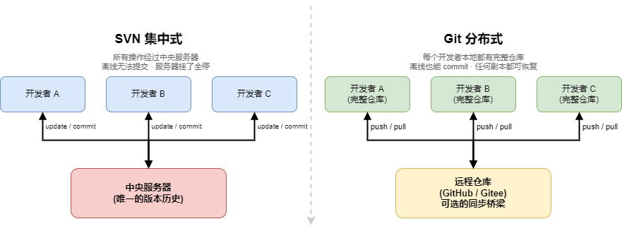

集中式架构有它的特点：

- 权限管理精细，适合对代码访问控制有严格要求的团队
- 客户端轻量，初始检出（checkout）只需下载最新版本，无需拉取全部历史

同时也带来了一些限制：

- 离线无法提交、查看日志
- 分支操作成本较高（SVN 分支本质是目录的「廉价复制」，底层用了 copy-on-write 优化，但对用户而言操作步骤多于 Git）
- 依赖中央服务器的可用性，服务器故障会影响团队协作

至今仍有不少企业使用 SVN，尤其是在对权限管理和审计追溯要求较高的行业。对于分支操作不频繁、重视目录级权限控制的团队，SVN 依然是够用的选择。

## 2.3 Git

Git 由 Linus Torvalds 于 2005 年创建，最初是为了管理 Linux 内核的开发。它采用**分布式架构**——每个开发者本地都有完整的仓库副本（见上图右侧）。

核心区别：

- 不联网也能 commit、查看历史、创建分支
- 分支极其廉价（本质是指针），鼓励频繁使用分支
- 数据完整性通过对象哈希保证——任何改动都会改变哈希值（默认使用 SHA-1，新版本 Git 也支持 SHA-256）

## 2.4 三者对比

| 特性 | CVS | SVN | Git |
| --- | --- | --- | --- |
| **架构** | 集中式 | 集中式 | 分布式 |
| **原子提交** | 不支持 | 支持 | 支持 |
| **离线工作** | 不支持 | 不支持 | 完全支持 |
| **分支成本** | 较高 | 较高 | 极低（指针） |
| **速度** | 慢 | 中等 | 快 |
| **学习曲线** | 低 | 低 | 中等 |
| **数据完整性** | 弱 | 有校验机制 | 对象哈希保证（默认 SHA-1，也支持 SHA-256） |
| **当前状态** | 仍有使用 | 部分企业在用 | 行业标准 |

# 三、Git 核心概念

Git 有三个核心区域，理解它们是用好 Git 的前提：

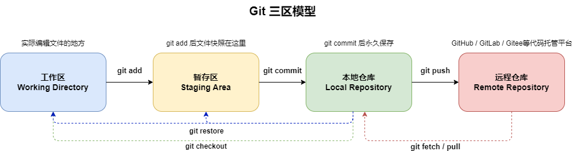

| 区域 | 位置 | 说明 |
| --- | --- | --- |
| **工作区 (Working Directory)** | 你电脑上的项目目录 | 实际编辑文件的地方 |
| **暂存区 (Staging Area)** | `.git/index` | 记录下次要提交的文件信息 |
| **本地仓库 (Local Repository)** | `.git` | 所有已提交的版本历史 |

远程仓库（如 GitHub、Gitee）是多人协作的桥梁，不是必须的——纯本地项目完全可以只用前三个区域。

# 四、Git 基础操作

## 4.1 初始化与克隆

从零开始一个新项目用 `git init`，加入已有项目用 `git clone`：

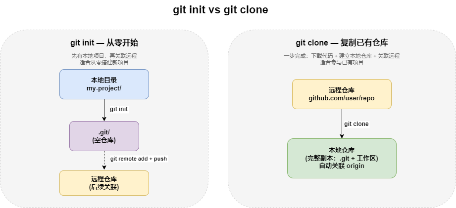

```bash
# 在当前目录初始化仓库
git init

# 克隆远程仓库到本地
git clone https://github.com/user/repo.git

# 克隆指定分支
git clone -b develop https://github.com/user/repo.git

```

## 4.2 日常提交

```bash
# 查看当前改动
git status

# 添加单个文件到暂存区
git add src/main/java/App.java

# 添加所有改动
git add .    # 添加当前目录下所有改动（注意可能误加不需要的文件）

# 提交
git commit -m "feat: 添加用户登录接口"

# 推送到远程
git push origin main

```

## 4.3 分支操作

Git 的分支本质上是一个指向某个 commit 的指针，创建和切换都极快。下图展示了 commit、创建分支、切换分支时指针的变化：

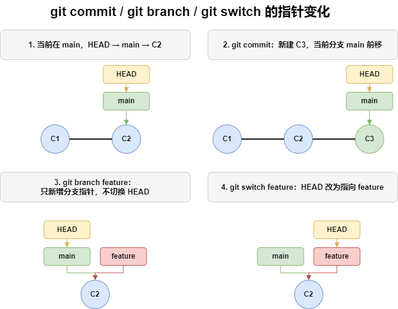

指令如下：

```bash
# 查看所有分支（-a 包含远程分支）
git branch -a

# 创建分支（只新建指针，不切换，对应上图第 3 步）
# 分支名格式：类型/描述，如 feature/user-auth（用户认证功能）
git branch feature/user-auth

# 切换到新分支（HEAD 改为指向 feature，对应上图第 4 步）
git switch feature/user-auth

# 以上两步可以合并为一条命令
git switch -c feature/user-auth
# 或传统的写法
git checkout -b feature/user-auth

# 合并分支（先切回目标分支）
git switch main
git merge feature/user-auth

# 删除已合并的分支
git branch -d feature/user-auth

```

## 4.4 查看历史

```bash
# 简洁的单行日志
git log --oneline

# 带分支图
git log --oneline --graph --all

# 查看某次提交的详细改动
git show <commit-hash>

# 查看某个文件的修改历史
git log --oneline -- path/to/file.java

```

## 4.5 拉取与同步

本地仓库和远程仓库之间通过 fetch、pull、push 三个命令同步数据：

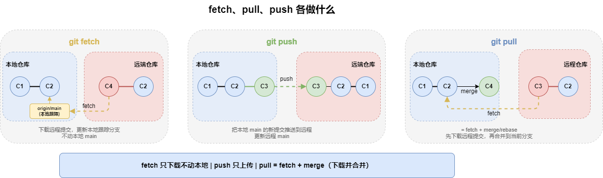

```bash
# 推送：把本地 main 的新提交推送到远程 main
git push origin main

# 抓取：下载远程的新提交（C4），只更新本地跟踪分支，不动本地 main（对应图下方虚线箭头）
git fetch origin

# 拉取：= fetch + merge，下载远程更新并合并到当前分支
git pull origin main

# 拉取并 rebase（保持线性历史）
git pull --rebase origin main

# 查看远程仓库信息
git remote -v

```

`fetch`、`pull`、`push` 的区别：

| 命令 | 做了什么 | 移动哪些指针 |
| --- | --- | --- |
| `fetch` | 下载远程最新提交到本地 | 只更新 `origin/main`（本地跟踪分支），不改本地 `main` |
| `pull` | 下载并合并到当前分支 | 先 fetch（更新本地跟踪分支），再 merge 到本地 `main` |
| `push` | 把本地新提交上传到远程 | 把本地 `main` 指向的提交推送到远程，更新远程 `main` |

> 日常开发中最常用的是 `git pull --rebase`（拉取更新）和 `git push`（推送提交）。单独用 `git fetch` 的场景是：只想看看远程有没有更新，暂不合并到本地。

## 4.6 .gitignore：忽略不需要追踪的文件

项目中有些文件不应该提交到仓库，比如编译产物、IDE 配置、依赖目录。在项目根目录创建 `.gitignore` 文件，Git 会自动忽略匹配的文件。

```gitignore
# Java
target/
*.class
*.jar

# Node.js
node_modules/
dist/

# IDE
.idea/
.vscode/
*.iml

# 系统文件
.DS_Store
Thumbs.db

# 敏感信息
.env
application-secret.yml

```

**常见规则：**

| 写法 | 作用 |
| --- | --- |
| `target/` | 忽略所有名为 `target` 的目录 |
| `*.class` | 忽略所有 `.class` 文件 |
| `!Main.class` | 例外：不忽略 `Main.class` |
| `/build/` | 只忽略根目录下的 `build`（不忽略子目录中的） |
| `**/*.log` | 忽略所有目录下的 `.log` 文件 |

**常用模板**：[github/gitignore](https://github.com/github/gitignore) 仓库收录了各种语言和框架的标准 `.gitignore` 模板，直接复制即可。

**已经提交了不该提交的文件？**

```bash
# 从仓库中移除（但保留本地文件）
git rm -r --cached node_modules/

# 提交这次移除
git commit -m "chore: 从版本控制中移除 node_modules"

```

> `.gitignore` 只对未追踪的文件生效。如果文件已经被提交（commit）到仓库中，必须先用 `git rm --cached` 从版本历史中移除，`.gitignore` 才会开始忽略它。

# 五、Git 进阶操作

## 5.1 暂存工作进度

写到一半需要紧急切分支修复 bug？用 `stash` 把当前改动临时存起来，工作区恢复干净状态，切回来再恢复：

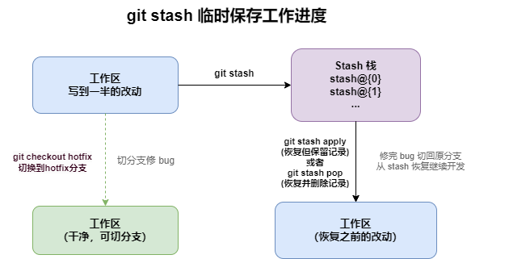

相关指令：

```bash
# 暂存当前改动
git stash

# 暂存并添加描述（推荐，方便区分多个 stash）
git stash push -m "用户登录页面开发中"

# 包含未跟踪的文件（新建但没 git add 的文件默认不会被 stash）
git stash push -u -m "包含未跟踪文件"

# 包含未跟踪和 ignored 的文件
git stash push -a -m "包含未跟踪和 ignored 文件"

# 恢复最近一次暂存的内容
git stash pop

# 恢复但不删除 stash 记录
git stash apply

# 查看所有暂存记录
git stash list

# 删除指定的 stash 记录
git stash drop stash@{0}

# 清空所有 stash
git stash clear

# 恢复指定的 stash
git stash apply stash@{2}

```

## 5.2 版本回退

`reset` 和 `revert` 都能撤销提交，但方式不同——reset 移动分支指针，revert 创建新的反向提交：

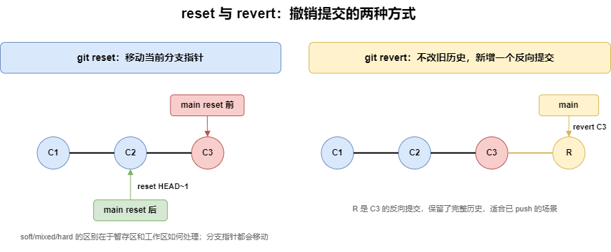

```bash
# 回退到某个 commit，保留改动在暂存区（推荐）
git reset --soft HEAD~1

# 回退到某个 commit，保留改动在工作区
git reset --mixed HEAD~1

# 回退到某个 commit，丢弃所有改动（危险）
git reset --hard HEAD~1

# 创建一个新 commit 来"撤销"某次提交（安全，适合已 push 的场景）
git revert <commit-hash>

```

`reset` 和 `revert` 的选择原则：

- **本地分支**还没 push：用 `reset`，直接改写历史
- **已 push** 到远程：用 `revert`，创建新的撤销提交，不破坏历史

## 5.3 提交修正

`commit --amend` 会用一个新的提交替换最近一次提交（哈希值改变），适合修正提交信息或补充遗漏的文件：

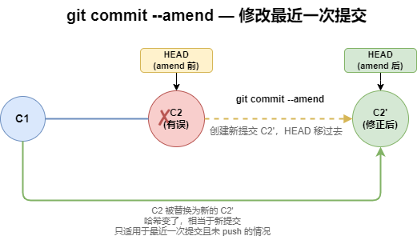

```bash
# 修改最近一次提交的信息
git commit --amend -m "fix: 修正拼写错误"

# 追加文件到最近一次提交（不改提交信息）
git add forgotten_file.java
git commit --amend --no-edit

```

## 5.4 Cherry-pick

把某个分支上的特定 commit 摘过来，复制为当前分支上的一个新提交：

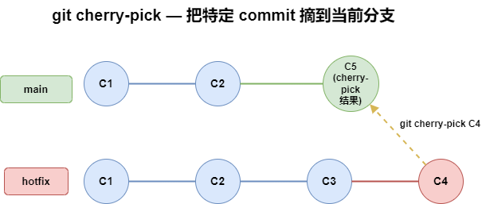

```bash
# 把 abc1234 这个 commit 应用到当前分支
git cherry-pick abc1234

# 摘取多个连续的 commit（A..B 不包含 A 包含 B ，要包含左端点用 A^..B）
git cherry-pick abc1234..def5678

```

适合的场景：hotfix 分支修了一个 bug，需要同步到多个 release 分支。

## 5.5 Rebase

Rebase 把当前分支的 commit "搬到"目标分支的最新提交之后，改写提交历史，让分支图变成一条直线：

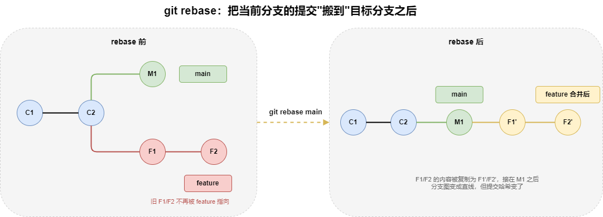

```bash
# 把当前分支的改动"搬到" main 的最新提交之后
git checkout feature/user-auth
git rebase main

# 交互式 rebase：合并、重排、修改最近 3 个 commit
git rebase -i HEAD~3

```

> **注意**：`rebase` 会改写提交历史。对于已经 push 到远程并有其他人基于它开发的分支，不要用 `rebase`，用 `merge`。

## 5.6 Fast-forward 与三方合并

`git merge` 不一定都会产生新的合并提交。它有两种常见结果：

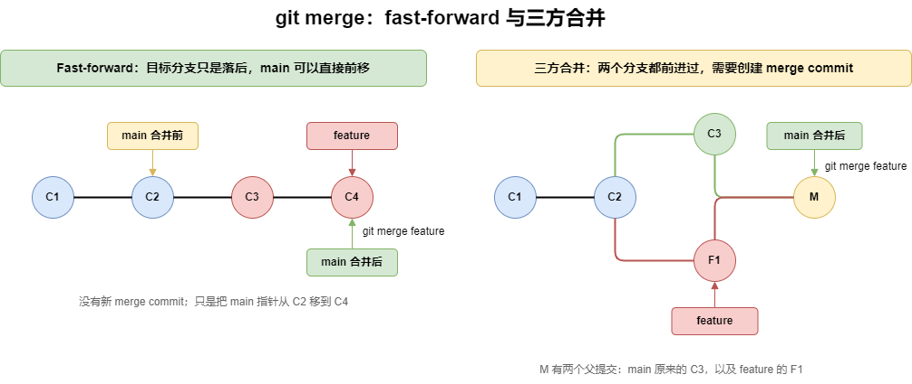

- **Fast-forward**：目标分支只是落后于被合并分支，没有自己的新提交。Git 只需要把目标分支指针往前移动，不会创建新的 merge commit。
- **三方合并**：两个分支都各自有新提交，Git 会找到共同祖先，把两边改动合成一个新的 merge commit。

```bash
# 当前在 main，合并 feature
git merge feature

# 强制保留 merge commit，即使可以 fast-forward
git merge --no-ff feature

# 只允许 fast-forward；如果需要三方合并就直接失败
git merge --ff-only feature

```

## 5.7 合并冲突处理

当你合并分支、拉取更新或 rebase 时，如果两个分支修改了同一个文件的同一行，Git 就无法自动合并，会报冲突：

```
Auto-merging src/main/java/UserService.java
CONFLICT (content): Merge conflict in src/main/java/UserService.java
Automatic merge failed; fix conflicts and then commit the result.

```

### 冲突长什么样

Git 会在冲突文件中插入标记：

```java
public String getUserName(User user) {
<<<<<<< HEAD
    return user.getLastName() + " " + user.getFirstName();
=======
    return user.getFirstName() + " " + user.getLastName();
>>>>>>> feature/name-order
}

```

- `<<<<<<< HEAD` 到 `=======` 之间：当前分支的内容
- `=======` 到 `>>>>>>> feature/name-order` 之间：要合并的分支的内容

### 解决步骤

**第一步**：打开冲突文件，找到冲突标记，决定保留哪部分（或者合并两者）。比如决定用当前分支的写法：

```java
public String getUserName(User user) {
    return user.getLastName() + " " + user.getFirstName();
}

```

把 `<<<<<<<`、`=======`、`>>>>>>>` 这三行标记和不需要的内容全部删掉。

**第二步**：标记为已解决并提交：

```bash
# 告诉 Git 这个文件的冲突已解决
git add src/main/java/UserService.java

# 如果是 merge 冲突
git commit

# 如果是 rebase 冲突
git rebase --continue

```

### 工具辅助

VS Code 内置了冲突解决界面，会用颜色高亮冲突区域，提供 **Accept Current Change**、**Accept Incoming Change**、**Accept Both Changes** 三个按钮，点一下就行，比手动删标记方便很多。

其他工具：IntelliJ IDEA、Beyond Compare、KDiff3 等也都提供了可视化冲突解决功能。

### 预防冲突

- 经常同步远程更新（`git fetch` 或 `git pull --rebase`），减少与主分支的偏差
- 一个 PR 尽量小，改动范围越广越容易冲突
- 避免多人同时修改同一个文件的同一区域

# 六、git worktree：多分支并行开发

## 6.1 传统分支切换的痛点

你正在 `main` 分支开发新功能，写了一半。突然线上出了 bug，需要切到 `hotfix` 分支紧急修复。传统做法是 `stash` → `checkout` → 修完 → `checkout` 回来 → `stash pop`。这种方式有几个问题：

- 频繁 `stash/pop` 容易丢失上下文，甚至产生冲突
- 如果两个分支依赖不同版本的 node_modules 或 build 产物，切分支后需要重新 `npm install` / `mvn compile`
- 无法同时在两个分支上并行查看代码

`git worktree` 让你从同一个仓库中检出**多个工作目录**，每个目录对应不同的分支，共享同一个 `.git` 仓库数据。

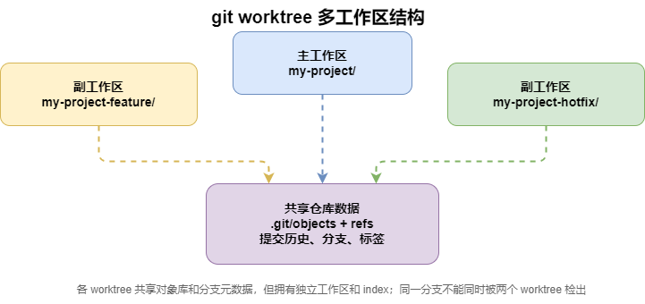

两个目录共享提交历史、分支信息，但各自有独立的工作区和暂存区，**互不干扰**。

## 6.2 基本用法

```bash
# 检出已有的 hotfix 分支到同级目录（分支必须已存在）
git worktree add ../my-project-hotfix hotfix

# 如果分支不存在，用 -b 从当前分支创建并检出
git worktree add -b feature/new-api ../my-project-api

# 在新目录里正常开发
cd ../my-project-hotfix
git add .
git commit -m "fix: 修复用户登录超时问题"
git push origin hotfix

# 回到主工作区继续开发
cd ../my-project

```

```bash
# 查看所有 worktree
git worktree list

# 输出：
# /path/to/my-project          abc1234 [main]
# /path/to/my-project-hotfix   def5678 [hotfix]

# 用完后移除
git worktree remove ../my-project-hotfix

```

## 6.3 相比 stash + checkout 的优势

|  | stash + checkout | worktree |
| --- | --- | --- |
| **上下文保留** | 切回来需要手动恢复 | 各工作区独立，随时切换 |
| **构建产物** | 切分支后可能要重新编译 | 各目录独立编译，互不影响 |
| **并行查看** | 不可能 | 同时打开两个分支的代码 |
| **操作复杂度** | 4 步（stash → checkout → checkout → pop） | 1 步（cd 到另一个目录） |

## 6.4 实战场景

### 并行开发两个功能

```bash
# 从 main 创建新功能分支并检出到独立目录
git worktree add -b feature/feature-a ../project-feature-a main
git worktree add -b feature/feature-b ../project-feature-b main

```

两个 VS Code 窗口分别打开两个目录，独立开发，独立编译。

### 排查线上 bug 时保留当前工作

```bash
# -b 从 origin/main 创建本地分支，避免 detached HEAD
git worktree add -b hotfix/login-timeout ../project-hotfix origin/main
cd ../project-hotfix
# 排查和修复...
git add .
git commit -m "fix: 修复登录超时"
git push origin hotfix/login-timeout

```

主工作区的代码、未暂存的改动全部保持原样。

### 对比两个版本的代码

```bash
git worktree add ../project-v1.0 v1.0.0
diff -r ../project/src ../project-v1.0/src

```

比 `git diff` 更直观——你可以同时用编辑器打开两个版本的代码。

### Review 他人分支

```bash
git worktree add ../project-review colleague/feature-x
cd ../project-review
# 阅读代码、运行测试、验证功能

```

不影响自己的工作区，review 完直接移除。

## 6.5 注意事项

1. **worktree 之间不能检出同一个分支**——同一个分支只能在一个 worktree 中处于活跃状态
2. **不要手动删除 worktree 目录**——用 `git worktree remove`，否则 `.git/worktrees` 下会残留元数据

```bash
# 不小心手动删除了目录？用 prune 清理残留元数据
git worktree prune

```

# 七、提交信息规范

好的提交信息不是写给自己的，是写给团队和未来的自己的。一条清晰的提交信息能帮助快速定位变更原因、自动生成变更日志。

## 7.1 Conventional Commits 规范

业界最广泛使用的规范是 [Conventional Commits](https://www.conventionalcommits.org/)，源自 Angular 团队的提交约定。核心格式：

```
<type>(<scope>): <description>

[optional body]

[optional footer]

```

### type 类型

| type | 含义 | 示例 |
| --- | --- | --- |
| `feat` | 新功能 | `feat(auth): 添加JWT令牌刷新机制` |
| `fix` | 修复 bug | `fix: 修复分页查询偏移量计算错误` |
| `docs` | 文档变更 | `docs: 更新README安装步骤` |
| `style` | 代码格式（不影响逻辑） | `style: 统一缩进为4空格` |
| `refactor` | 重构（既不是 feat 也不是 fix） | `refactor(utils): 提取通用树构建逻辑` |
| `perf` | 性能优化 | `perf: 优化列表渲染，减少不必要的重绘` |
| `test` | 测试相关 | `test: 补充用户注册接口单元测试` |
| `build` | 构建系统或外部依赖 | `build: 升级Spring Boot到3.2` |
| `ci` | CI 配置 | `ci: 添加GitHub Actions自动部署` |
| `chore` | 其他杂项 | `chore: 清理无用的配置文件` |

### scope（可选）

括号里的范围，说明改动影响的模块：

```
feat(auth): 添加短信验证码登录
fix(order): 修复并发下单重复创建问题
refactor(database): 统一数据源配置方式
```

如果没有明显的模块范围，可以省略：

```
fix: 修复编译警告
docs: 更新变更日志
```

### Breaking Change

当改动引入了**不兼容的变更**时，需要特别标注：

方式一：在 type 后加 `!`：

```
feat!: 数据库连接池配置字段重命名
```

方式二：在 footer 中说明：

```
feat: 重构配置类结构

BREAKING CHANGE: DatabaseConfig 类从 com.config 移至 com.config.db
```

### body 和 footer

body 用于补充详细说明，footer 用于关联 issue 等元信息：

```
fix(auth): 修复Token过期后未自动刷新的问题

Token刷新逻辑中存在竞态条件：当多个请求同时到达且Token已过期，
会触发多次刷新请求。改为使用队列机制，确保只有一个请求执行刷新。

Closes #123

```

### 完整示例

```bash
# 简单的新功能
git commit -m "feat: 添加用户头像上传功能"

# 带范围的修复
git commit -m "fix(api): 修复列表接口返回空指针异常"

# Breaking change
git commit -m "feat!: 移除已废弃的v1版本接口"

# 带详细说明
git commit -m "refactor: 重构权限校验逻辑

将分散在各Controller中的权限判断逻辑统一收口到
@RequiresPermission注解中，通过AOP拦截实现。

Closes #45"

```

## 7.2 提交信息的写作原则

**标题行：**

- 不超过 72 个字符（超出部分在 `git log --oneline` 中会被截断）
- 用祈使语气（"添加"而不是"添加了"）
- 不以句号结尾

**正文（如有）：**

- 与标题行之间空一行
- 解释 **为什么** 做这个改动，而不是 **做了什么**（代码本身已经说明做了什么）

**反面教材 vs 正确写法：**

```
# 反面
fix bug
update code
修改
调试

# 正确
fix: 修复并发场景下库存扣减为负数的问题
refactor: 将Redis连接配置提取为独立模块
feat(search): 添加全文检索支持Elasticsearch

```

## 7.3 工具辅助

可以用工具来强制执行规范：

- **commitlint**：校验提交信息是否符合规范
- **husky**：在 git hook 中自动运行 commitlint
- **commitizen**：交互式生成规范的提交信息

```bash
# 安装 commitizen（全局）
npm install -g commitizen cz-conventional-changelog

# 之后用 git cz 代替 git commit，会交互式引导填写
git cz

```

# 八、代码托管平台与协作流程

Git 是版本控制工具，代码需要托管在远程平台上进行协作。国内常见的平台有 GitHub、GitLab、Gitee 等：

## 8.1 平台对比

| 特性 | GitHub | GitLab | Gitee |
| --- | --- | --- | --- |
| **定位** | 全球最大的开源社区 | DevOps 全流程平台 | 国内最大的代码托管平台 |
| **私有仓库** | 免费，仓库和协作者不限；Actions 等有额度限制 | GitLab.com 免费层有用户数限制，自建版按部署策略 | 免费，个人私有仓库协作人数有限制（通常 5 人以内，以官方配额为准） |
| **CI/CD** | GitHub Actions | 内置 GitLab CI/CD | 需配合第三方 |
| **访问速度（国内）** | 较慢，偶尔被墙 | 自建可解决 | 快 |
| **开源生态** | 最丰富 | 较丰富 | 中文项目为主 |
| **特色** | Copilot AI、庞大的社区 | 完整的 DevOps 链条、支持私有化部署 | 国内访问快、适合国内团队 |

**选择建议：**

- 开源项目或面向国际 → **GitHub**
- 企业内部需要完整的 CI/CD 和私有化部署 → **GitLab**（可自建）
- 国内团队、需要稳定快速的访问 → **Gitee**

这几个平台的操作逻辑基本一致：创建仓库 → 关联远程 → 推送代码 → Fork/PR 协作。下面以 GitHub 为主讲解，GitLab 和 Gitee 的操作大同小异。

## 8.2 配置 SSH 密钥

推送代码到远程仓库需要身份认证。HTTPS 方式每次操作都要输密码（或配 token），SSH 密钥配一次就能长期使用。

### 生成 SSH 密钥

```bash
# 生成密钥对（一路回车用默认值即可）
ssh-keygen -t ed25519 -C "your_email@example.com"

# 如果你的系统不支持 ed25519，用 RSA
ssh-keygen -t rsa -b 4096 -C "your_email@example.com"

```

执行后会在 `~/.ssh/` 目录下生成两个文件：

- `id_ed25519` — 私钥（不要泄露）
- `id_ed25519.pub` — 公钥（要添加到平台）

### 将公钥添加到平台

```bash
# 查看公钥内容
cat ~/.ssh/id_ed25519.pub

```

复制输出的内容，然后：

- **GitHub**：Settings → SSH and GPG keys → New SSH key → 粘贴
- **GitLab**：Preferences → SSH Keys → 粘贴
- **Gitee**：设置 → SSH公钥 → 粘贴

### 验证连通性

```bash
# GitHub
ssh -T git@github.com

# GitLab
ssh -T git@gitlab.com

# Gitee
ssh -T git@gitee.com

```

看到 `Hi xxx! You've successfully authenticated` 就说明配好了。

### 使用 SSH 地址克隆

配置好 SSH 后，克隆时用 SSH 地址而不是 HTTPS 地址：

```bash
# HTTPS（每次要输密码或 token）
git clone https://github.com/user/repo.git

# SSH（用密钥认证，无需输密码）
git clone git@github.com:user/repo.git

```

在仓库页面点 **Code** 按钮，切换到 SSH 选项卡就能看到 SSH 地址。

## 8.3 新建远程仓库并推送

### 在平台上创建仓库

1. 登录平台，点击 **New repository**（GitHub/GitLab）或 **新建仓库**（Gitee）
2. 填写仓库名（如 `my-project`）
3. 选择公开（Public）或私有（Private）
4. 可选：勾选初始化 README
5. 点击创建

### 将本地项目推送到新仓库

```bash
# 在本地项目目录中
git init
git add .
git commit -m "chore: 初始化项目"

# 确保本地分支名为 main（git init 默认可能是 master）
git branch -M main

# 关联远程仓库（用你自己的仓库地址）
git remote add origin https://github.com/your-username/my-project.git

# 推送并设置上游分支
git push -u origin main

```

> **注意**：GitHub 和 GitLab 默认分支名是 `main`，Gitee 默认可能是 `master`（以平台创建仓库时显示为准）。

## 8.4 分支策略：团队怎么组织分支

一个人写代码，从 main 切个分支就够了。但团队协作时，需要一套统一的分支策略来规范：哪些分支是稳定的、哪些是开发中的、什么时候合并、什么时候发版。

目前主流的有两种方案。

### Git Flow

适合有**固定发版节奏**的项目，比如每两周发一个版本的 App、需要维护多个版本的后台系统。

分支结构：

```
develop (开发主干)
 ├── feature/user-login (功能分支)
 ├── feature/order-list (功能分支)
 └── release/v1.2 (预发布分支，从 develop 切出)
      └──→ 合并到 main + develop

main (生产分支，永远可部署)
 └── hotfix/critical-bug (紧急修复，从 main 切出)
      └──→ 合并到 main + develop

```

各分支职责：

| 分支 | 说明 | 生命周期 |
| --- | --- | --- |
| `main` | 生产环境代码，每次合并代表一次发版 | 永久 |
| `develop` | 开发主干，日常开发的集成分支 | 永久 |
| `feature/*` | 新功能开发，从 develop 切出，完成后合并回 develop | 短期 |
| `release/*` | 发版准备，从 develop 切出，只做 bug 修，完成后合并到 main 和 develop | 短期 |
| `hotfix/*` | 线上紧急修复，从 main 切出，完成后合并到 main 和 develop | 极短期 |

Git Flow 的优点是分支职责清晰，适合多人并行开发多个功能、需要维护多版本的场景。缺点是分支多、流程重，对于快速迭代的项目来说太繁琐了。

### GitHub Flow

适合**持续部署**的项目，比如 Web 服务、SaaS 产品——代码合并到 main 就自动上线。

只有两条规则：

1. `main` 分支永远是可部署的
2. 所有开发都在短生命周期的功能分支上进行，通过 PR 合并回 main

```
main (永远可部署)
 ├── feature/user-login → PR → merge → 自动部署
 ├── feature/order-list → PR → merge → 自动部署
 └── fix/search-bug    → PR → merge → 自动部署

```

没有 develop、没有 release 分支。简单直接，配合 CI/CD 效率很高。但如果需要维护多个线上版本（比如 v1.x 和 v2.x 同时维护），GitHub Flow 就不太够用了。

### 怎么选

| 场景 | 推荐 |
| --- | --- |
| Web 服务、SaaS，持续部署 | GitHub Flow |
| App、需要维护多版本、固定发版周期 | Git Flow |
| 小团队、快速迭代 | GitHub Flow |
| 大团队、合规要求严格 | Git Flow |

> 不管选哪种，关键是**团队统一**。最怕的是有人用 Git Flow，有人直接往 main 推，最后分支混乱。

### 分支命名规范

不管用哪种策略，分支命名建议统一格式：

```
feature/简短描述    — 新功能    例：feature/user-avatar
fix/简短描述       — bug修复   例：fix/login-timeout
hotfix/简短描述    — 紧急修复  例：hotfix/payment-crash
release/版本号     — 发版      例：release/v2.1.0

```

可以用 Git 配置让创建分支更方便：

```bash
# 配置默认分支名
git config --global init.defaultBranch main

```

## 8.5 Fork + Pull Request 工作流

在团队协作或参与开源项目时，你通常没有直接推送到主仓库的权限。这时候用 **Fork + Pull Request**（GitLab 中叫 **Merge Request**）的方式：

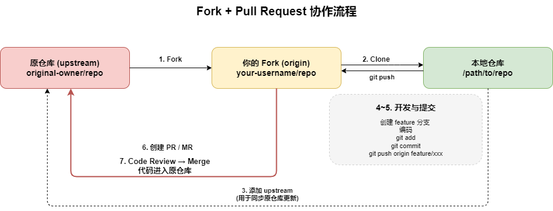

### Step 1：Fork 仓库

在目标仓库页面，点击 **Fork** 按钮（GitHub/Gitee）或 **Fork**（GitLab）。这会在你的账号下创建一份仓库副本。

### Step 2：Clone 到本地

```bash
git clone https://github.com/your-username/repo.git
cd repo

```

### Step 3：添加上游仓库

```bash
git remote add upstream https://github.com/original-owner/repo.git

# 确认远程配置
git remote -v
# origin    https://github.com/your-username/repo.git (fetch)
# origin    https://github.com/your-username/repo.git (push)
# upstream  https://github.com/original-owner/repo.git (fetch)
# upstream  https://github.com/original-owner/repo.git (push)

```

### Step 4：创建功能分支

**通常不要在 main 分支上直接开发**。每次开发都从最新的 main 分支切出新分支：

```bash
# 同步原仓库的最新代码
git fetch upstream
git checkout main
git rebase upstream/main

# 创建功能分支
git checkout -b feature/add-login

```

### Step 5：开发并提交

```bash
git add .
git commit -m "feat(auth): 添加微信扫码登录功能"

# 推送到你的 Fork
git push origin feature/add-login

```

### Step 6：创建 Pull Request / Merge Request

1. 打开你的 Fork 页面，平台会提示 **Compare & pull request**（GitHub）或 **Create merge request**（GitLab）
2. 填写信息：
  - **标题**：简洁描述改动内容
  - **正文**：说明改动的背景、实现方案、测试情况
  - **关联 Issue**：写 `Closes #123`，PR/MR 合并后会自动关闭 Issue
3. 选择 base 分支和 compare 分支
4. 提交

### Step 7：Code Review 与合并

PR/MR 创建后，项目维护者会进行 Code Review：

- **Review 通过**：维护者合并，你的代码进入主仓库
- **需要修改**：在本地继续修改，push 到同一个分支，PR/MR 会自动更新
- **冲突**：需要在本地解决

```bash
# 解决冲突：同步上游最新代码
git fetch upstream
git checkout feature/add-login
git rebase upstream/main

# 解决冲突后
git add .
git rebase --continue

# 强制推送到 Fork（因为 rebase 改写了历史）
git push origin feature/add-login --force-with-lease

```

> 用 `--force-with-lease` 代替 `--force`，它会在覆盖前检查远程是否有你没拉取过的新提交，避免意外丢失别人的改动。

## 8.6 同步 Fork

PR/MR 合并后，定期同步上游：

```bash
git fetch upstream
git checkout main
git merge upstream/main
git push origin main

```

## 8.7 PR/MR 礼仪

- **一个 PR 只做一件事**——不要在同一个 PR 里既修 bug 又加新功能
- **标题要清晰**——用 Conventional Commits 格式
- **描述要写清楚**——为什么做、怎么做的、怎么测的
- **保持小而精**——大型 PR 很难 review，也容易产生冲突
- **CI 通过了再请求 review**——不要让 reviewer 帮你发现 lint 错误

# 九、总结

## 常用命令速查

| 命令 | 用途 |
| --- | --- |
| `git add / commit / push` | 日常提交三件套 |
| `git branch / checkout / switch` | 分支管理 |
| `git pull / fetch` | 同步远程代码 |
| `git merge / rebase` | 分支合并 |
| `git stash` | 暂存工作进度 |
| `git reset / revert` | 版本回退 |
| `git cherry-pick` | 摘取特定提交 |
| `git worktree add/remove/list` | 多工作区并行开发 |
