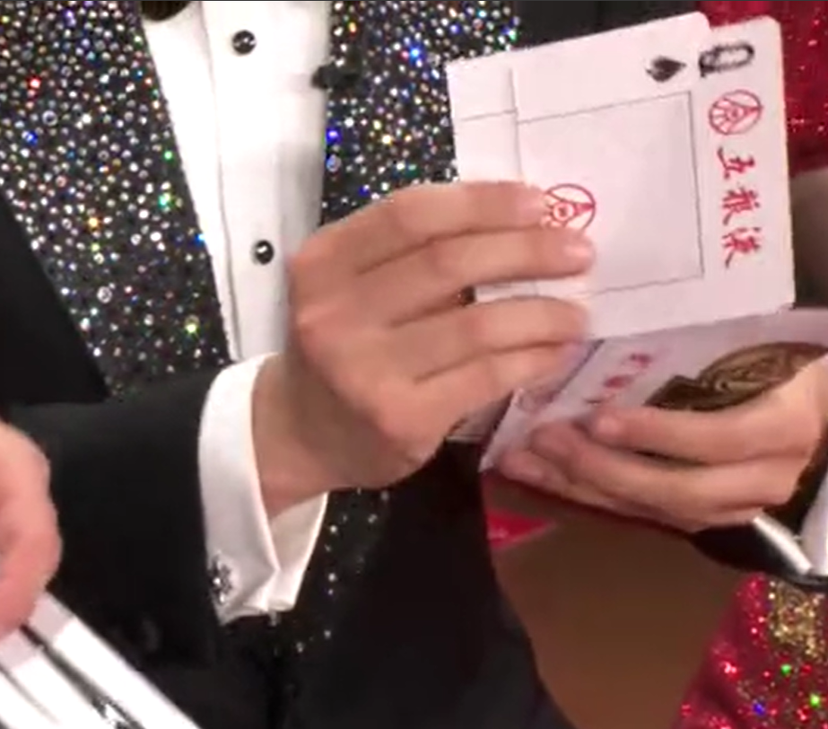
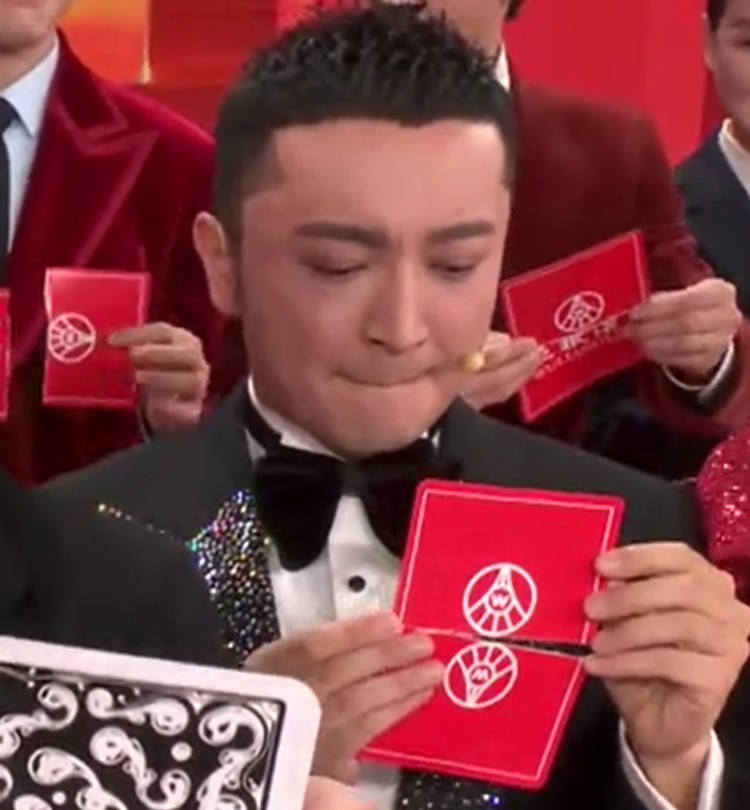

+++
title = "《守岁共此时》魔术解析"
date = 2024-02-11
draft = false
tags = ["算法", "Python"]
+++

## 一、引言

2024 央视春晚上，刘谦的魔术《**守岁共此时**》是我全场最喜欢的节目。当时看直播就觉得这背后肯定不只是巧合，应该有数学规律。自己研究的过程中接触到了约瑟夫环，感觉跟魔术最后的淘汰环节有些相似，于是就写了这篇分析。
## 二、具体步骤

- **第一步**：任意准备四张牌，随机打乱，不妨设打乱后的四张牌的顺序为：`J、Q、K、A`
- **第二步**：对半撕开分为 8 张牌，其中一半置于另一半下面，此时牌序为`J、Q、K、A、J、Q、K、A`，则此时满足：第 n 张牌与第 n+4 张牌相同，即：`n = n + 4`
- **第三步**：根据个人的名字字数将牌堆顶部相同数量的牌置于最下面，一般人都是 2~4 张，这里假设为三字的姓名，此时牌序为：`A、J、Q、K、A、J、Q、K`，但往下移动多少张牌并不重要，因为不会改变相同牌的相对顺序，即依然满足：`n = n + 4`
- **第四步**：拿起最上面三张，插入剩余卡牌中间的任意位置，这里假设插入剩余牌堆的第一张与第二张之间，此时牌序为：`K、A、J、Q、A、J、Q、K`，这里的牌序可简化看成：`K******K`
- **第五步**：将最上面的牌藏起来，即藏起来的牌为`K`，此刻牌序为：`******K`
- **第六步**：_根据南北方人属性的不同，从牌堆顶部取出 1~3 张，插入中间，但取出多张在并不重要，最后一张牌的位置不变就行：此刻牌序依然为：_`******K`_。_（主持人尼格买提即在这步出错，抽出的牌置于牌堆底部，改变了最后一张牌的位置）



- **第七步**：男生丢弃 1 张牌，女生丢弃 2 张牌，则此刻
  - 男生牌序为：`*****K`
  - 女生牌序为：`****K`
- **第八步**：「见证奇迹的时刻」，即从牌顶向下放七张牌，则此刻
  - 男生牌序为：`****K*`
  - 女生牌序为：`**K**`
- **第九步**：「好运留下来，烦恼丢出去」，即取顶部的牌置于牌堆底部，然后丢一张，如此循环：
  - 第一轮：男生：`**K**`，女生：`K***`
  - 第二轮：男生：`K***`，女生：`**K`
  - 第三轮：男生：`**K`，女生：`K*`
  - 第四轮：男生：`K*`，女生：`K`
  - 第五轮：男生：`K`
- **第十步**：此时我们发现剩余的一张牌与藏起来的牌可以合成一整张



## 三、代码实现（Python）

```python
cards = ['J', 'Q', 'K', 'A', 'J', 'Q', 'K', 'A']
print(f"原始排序：{cards}")

# step1：把最顶上和名字字数相同的牌数放到最下面
name_len = int(input("请输入您名字的字数："))
if name_len > 8:
    name_len -= 8
step1 = []
for i in range(name_len):
    step1.append(cards[i])
for i in range(name_len):
    cards.pop(0)
cards.extend(step1)
print(f"step1排序：{cards}")

# step2：拿出3张牌插入中间任意位置，本代码将其插入取出后牌堆的第一张和第二张牌之间
step2 = []
for i in range(3):
    step2.append(cards[i])
for i in range(3):
    cards.pop(0)
for i in range(3):
    cards.insert(1, step2[2-i])
print(f"step2排序：{cards}")

# step3：将第一张牌取出来
hide_card = cards.pop(0)
print(f"step3排序：{cards}，藏起来的牌为“{hide_card}”")

# step4：根据南北方人随机抽 1 ~ 3 张牌，将其插入中间任意位置，本代码将其插入取出后牌堆的第一张和第二张牌之间
local = int(input("南方人扣1，北方人扣2，不确定扣3："))
step3 = []
for i in range(local):
    step3.append(cards[i])
for i in range(local):
    cards.pop(0)
for i in range(local):
    cards.insert(1, step3[local - 1 -i])
print(f"step4排序：{cards}")

# step5：男生丢一张牌，女生丢两张牌
gender = int(input("男生扣1，女生扣2，都不是扣3："))
for i in range(gender):
    cards.pop(0)
print(f"step5排序：{cards}")

# step6：“见证奇迹的时刻”
for i in range(7):
    card = cards.pop(0)
    cards.append(card)
print(f"step6排序：{cards}")

# step7：“好运留下来，烦恼丢出去”
while len(cards) != 1:
    card = cards.pop(0)
    cards.append(card)
    card = cards.pop(0)

print(f"您藏起来的牌为：{hide_card}，最后剩余的牌为：{cards}")

```

## 四、总结

回过头来看，这个魔术的核心就两件事：撕牌时建立的配对关系，以及最后淘汰环节恰好保证配对中的一张存活。被藏起来的牌永远在奇数位置，所以循环淘汰到最后，剩下的那张一定能和它拼上。整个过程看起来像是巧合，其实每一步都是确定的。

研究这个魔术的时候我也了解到了约瑟夫环，虽然不完全是同一个问题，但思路确实有相通之处。能把一个数学规律包装成春晚魔术，让全国观众一起"见证奇迹"，这件事本身还挺酷的。